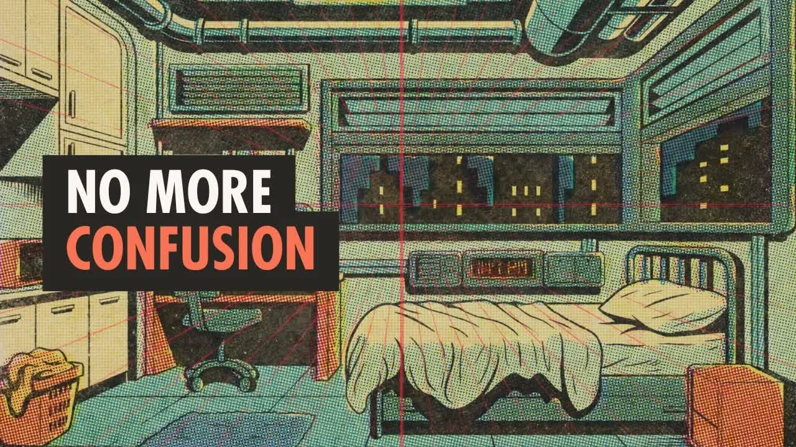

# How-to-Draw-with-One-Point-Perspective-(Without-Losing-Your-Mind)

  <picture>
    
  </picture>

 

---

## Video Information

| Property | Value |
|----------|-------|
| **Video Name** | `How-to-Draw-with-One-Point-Perspective-(Without-Losing-Your-Mind)` |
| **Original Link** | [YouTube Video](https://www.youtube.com/watch?v=XJN0wOieYMY) |
| **Total Size** | **2 parts** - **77.88 MB** |
| **Quality** | **720** |
| **Status** | **Complete (100%)** |
| **Password Protected** | **NO** |

---

## Download Links

> ⬇️ Download **all parts**, then open `How-to-Draw-with-One-Point-Perspective-(Without-Losing-Your-Mind).zip` — the other parts are found automatically.

| # | File | Link |
|---|------|------|
| 1 | `How-to-Draw-with-One-Point-Perspective-(Without-Losing-Your-Mind).z01` | [Download](https://raw.githubusercontent.com/MMAAMIZAA/Ourtube/main/videos/How-to-Draw-with-One-Point-Perspective-%28Without-Losing-Your-Mind%29/How-to-Draw-with-One-Point-Perspective-%28Without-Losing-Your-Mind%29.z01) |
| 2 | `How-to-Draw-with-One-Point-Perspective-(Without-Losing-Your-Mind).zip` | [Download](https://raw.githubusercontent.com/MMAAMIZAA/Ourtube/main/videos/How-to-Draw-with-One-Point-Perspective-%28Without-Losing-Your-Mind%29/How-to-Draw-with-One-Point-Perspective-%28Without-Losing-Your-Mind%29.zip) |

---

## How to Extract

Download all parts into the **same folder**, then:

| OS | Steps |
|----|-------|
| **Windows** | Double-click `How-to-Draw-with-One-Point-Perspective-(Without-Losing-Your-Mind).zip` — opens in Explorer, WinRAR, or 7-Zip automatically |
| **Mac** | Double-click `How-to-Draw-with-One-Point-Perspective-(Without-Losing-Your-Mind).zip` — extracts with Archive Utility or The Unarchiver |
| **Linux** | `unzip How-to-Draw-with-One-Point-Perspective-(Without-Losing-Your-Mind).zip` or right-click → Extract Here (Ark/File Manager) |
| **Android** | Tap `How-to-Draw-with-One-Point-Perspective-(Without-Losing-Your-Mind).zip` in your file manager — or use [ZArchiver](https://play.google.com/store/apps/details?id=ru.zdevs.zarchiver) |

---

*This tool created by [avasam.ir](https://avasam.ir)*
